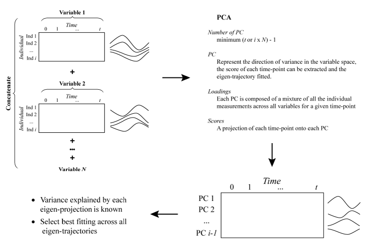
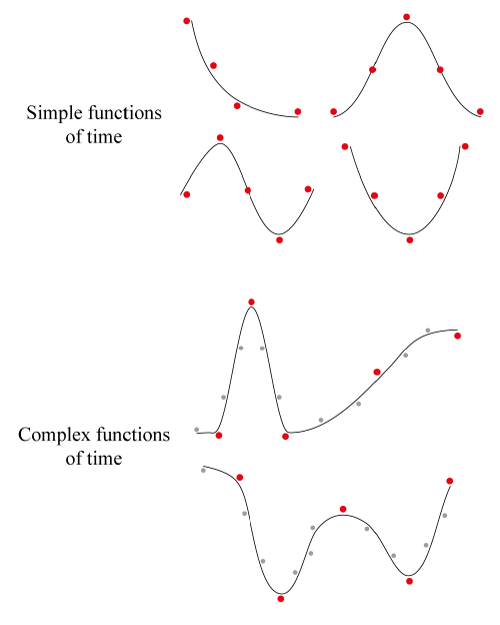

`santaR` is a Functional Data Analysis (_FDA_) approach where each individual's observations are condensed to a continuous smooth function of time, which is then employed as a new analytical unit in subsequent data analysis.

Fitting a smooth function to a time trajectory is equivalent to a denoising or signal extraction problem; a balance between the fitting of the raw data and the smoothing of the measurement error (or biological variability) must be found (see [santaR theoretical background](theoretical-background.html)).

`santaR` parametrise the smoothness of individual smooth-splines fit by fixing the number of effective degrees of freedom allowed (_df_) . _df_ can be described as the single meta-parameter that a user must select.
Although the 'ideal' solution, automated approaches for the selection of an optimal level of smoothing are still an area of active research; and while no definitive answer on the most suitable methodology can be provided, the following vignette will present the current state of these approaches and propose a strategy to help a user make an informed decision.

As the true underlying function of time is inaccessible and the optimal _df_ unknown, strategies for the estimation of smoothness and model selection must be devised. The fundamental question that must guide the tuning of the smoothing parameter is to know which observed curve features are _"real"_ and which are spurious artefacts of the fitting procedure (over-fitted). Most _FDA_ algorithms rely on an automated selection of the smoothness parameter; yet as
smoothness is central to the denoising and signal extraction procedure, the quality of the results will be highly dependent on the tuning^[Déjean, S., Martin, P. G. P., Baccini, A. & Besse, P. _Clustering time-series gene expression data using smoothing spline derivatives_. Eurasip Journal on Bioinformatics and Systems Biology 2007, 10 (2007)]. It can be noted that this challenge is shared with multiple other data analysis methods imposing a form of smoothness. The problem of selecting the window width or bandwidth in a kernel density estimator (KDE) is notably similar, resulting in shared literature and strategies^[Ramsay, J. & Silverman, B. W. _Functional Data Analysis_ Springer, 431 (John Wiley & Sons, Ltd, Chichester, UK, 2005)]  ^[Chaudhuri, P. & Marron, J. S. _SiZer for Exploration of Structures in Curves_. Journal of the American Statistical Association 94, 807-823 (1999)] ^[Chaudhuri, P. & Marron, J. S. _Scale Space View of Curve Estimation_. The Annals of Statistics 28, 408-428 (2000)]; even if most reported algorithm require around 20 time-points while most short trajectories hardly reach half this number.


The following vignette will focus on:

- Intuitive parametrisation of smoothing
- Automated model assessment and selection approaches
- Latent time-trajectories for _df_ selection
- Smoothness and experimental design


## Intuitive parametrisation of smoothing

Based on simulated data and diverse datasets, some intuitive rules for the selection of _df_ can be established:

> - _df_ controls the _"complexity"_ of the model employed. A substantial difference can be found when going from _2_ to _10_, but very little change will take place when going from _10_ to _50_ (the model only gets more complex, but the general shape won't change).
> - More time points do not automatically require a higher _df_. More inflexions (more complex shape) could require a higher _df_ if the number of points is sufficient (and the sampling frequency high).
> - A lower _df_ value is often more suited and generalisable (less over-fitted).
> - If the _df_ is for example _10_, all individuals trajectories with less of 10 time-points cannot be fitted and will be rejected.
> - On simulated data, the results (_p_-values) are resilient to most values of _df_, however the plots can look dramatically different.
> - Trying multiple values of _df_ on a subset of variables (using the GUI) and then selecting the fit that approximate the time evolution the best without over-fitting:
>
>     * _df=5_ is a good starting point in most cases (even more so if there is less than 10 time-points)
>     * If the number of time-points is large and the curves seem very under-fitted, _df_ can be increased to _6_, _7_ or more. Values higher than _10_ should rarely be required and will provide with a diminishing return. _df=number of time-points_ will result in a curve passing through all points (over-fitted).
>     * If the number of points is lower or the trajectories seem over-fitted, _df_ can be decreased to _4_ or _3_. (_3_ will be similar to a second degree polynomial, while _2_ will be a linear model)
>     * If the plots _"look right"_ and don't seem to _"invent"_ information between measured data-points, the _df_ is close to optimal.
    
As will be demonstrated in the following sections (_Automated model assessment and selection approaches_), it does not seem to be possible to automatically select the degree of freedom. A choice based on visualisation of the splines while being careful with over-fitting, keeping in mind the _"expected"_ evolution of the underlying process seems the most reasonable approach.

In practice, the results are resilient to the _df_ value selected across all variables, which is a function of the _study design_, such as the _number of time-points_, _sampling rate_ and, most importantly, the _complexity of the underlying function of time_. While an automated approach cannot infer the study design from a limited set of observations, an informed user will intuitively achieve a more consistent fit of the data (see _Smoothness and Experimental Design_). 


## Automated model assessment and selection approaches

In classical parametric statistics, a reduction of the RSS ensures the "closest" fit of the observations. However such a least-square fitting approach cannot be employed as the most over-fitting model would always be selected, resulting in an interpolation of the observations.

> As the present measurements are noisy and the models considered flexible, no "truth" or certainty can be found in the data. This bias set smoothing aside from classical parametric approaches and result in the complexity of automated selection of smoothness.

The most common methodology to tune the smoothing parameter consists in evaluating a metric (a measure the quality of the model) at different smoothing parameter values, and select the model that minimises/maximise the target metric. These metrics, like the fitting of a smoothingspline itself (see [santaR theoretical background](theoretical-background.html) _Equation 1_), must impose a trade-off between the goodness-of-fit and a penalty on the model complexity. Each metric will therefore potentially present a (different) bias depending on how the balance is established. This bias could ultimately define the metric's behaviour when a high or low number of samples are available. To evaluate a smoothing parameter for under- or over-fitting, the main model selection procedures employ the cross-validation score (**CV**), general cross-validation score (**GCV**), Akaike information criterion (**AIC**), Bayesian information criterion (**BIC**), or the corrected AIC (**AICc**).

Ordinary **CV** consists in dividing the _N_ data-points in _K_ groups or folds. Each fold will successively be used as a test set, while a model is trained on the remaining data. After a model is fitted (for a given smoothing parameter) with the K^th^ fold removed, the prediction error can be evaluated on the (unseen) K^th^ fold (test set). When this procedure has been repeated for all folds, each data point as been employed once as a test, and the prediction error across all folds can be averaged. This average prediction error provides an estimate of the curve's test error for a given smoothness parameter; the parameter that minimises the test error is subsequently selected^[Hastie, T., Tibshirani, R. & Friedman, J. _The Elements of Statistical Learning_. (Springer, 2009)].

**GCV**^[Craven, P. & Wahba, G. _Smoothing noisy data with spline functions - Estimating the correct degree of smoothing by the method of generalized cross-validation_. Numerische Mathematik 31, 377-403 (1978)] is a faster approximation of **CV** relying on the fact that, in some cases, the trace of the roughness matrix can be calculated more easily than the individual elements of its diagonal. **GCV** has been reported to possibly reduce the tendency of **CV** to under-smooth in some condition^[Hastie, T., Tibshirani, R. & Friedman, J. _The Elements of Statistical Learning_. (Springer, 2009)]. **GCV** and **CV** scores (i.e. test errors) have been described as changing slowly as $\lambda$ approaches the minimising value (corresponding to a wide range of $\lambda$ resulting in close test error values), making optimal smoothness hard to define ^[Ramsay, J., Hooker, G. & Graves, S. _Functional data analysis with R and MATLAB_ (Springer-Verlag, 2009)].

The remaining three metrics commonly employed in model selection (i.e. **AIC**, **BIC**, **AICc**) are less computationally intensive as they rely on the log-likelihood of the model^[Rice, J. A. & Wu, C. O. _Nonparametric mixed effects models for unequally sampled noisy curves_. Biometrics 57, 253-259 (2001)] ^[James, G. M. & Hastie, T. J. _Functional linear discriminant analysis for irregularly sampled curves_. Journal of the Royal Statistical Society, Series B 63, 533-550 (2001)]. These metrics penalise models based on the number of parameters, to balance the goodness of fit versus model complexity. The Akaike information criterion^[Akaike, H. _Information Theory And An Extension Of The Maximum Likelihood Principle By Hirotogu Akaike_. Second International Symposium on Information Theory, 267-281 (1973)] ^[Akaike, H. _A New Look at the Statistical Model Identification_. IEEE Transactions on Automatic Control 19, 716-723 (1974)], defined as AIC = $2k - 2\mathcal{L}$ , where $\mathcal{L}$ is the log-likelihood and $k$ the number of parameters, rewards goodness of fit (estimated by $\mathcal{L}$) while increasingly penalising each added parameter. Across candidate models (e.g. varying smoothing parameter employed), the model which minimises **AIC** is preferred.

The Bayesian information criterion^[Schwarz, G. _Estimating the Dimension of a Model_. The Annals of Statistics 6, 461-464 (1978)], defined as BIC = $log(n)k - 2\mathcal{L}$, where $n$ is the sample size^[Wu, H. & Zang, J.-T. _Nonparametric Regression Methods for Longitudinal Data Analysis: mixed-effects modeling approaches_ (Wiley-VCH Verlag GmbH & Co. KGaA, Hoboken, NJ, USA, 2006)] ^[Hedeker, D. R. & Gibbons, R. D. _Longitudinal Data Analysis_ (Wiley-Interscience, 2006)] ^[Azari, R., Li, L. & Tsai, C.-L. _Longitudinal data model selection_. Computational Statistics & Data Analysis 50, 3053-3066 (2006)], is an information criterion established in a Bayesian framework, taking the sample size into account when penalising a model fit. Like **AIC**, the model minimising **BIC** is preferred. Different behaviour of **AIC** and **BIC** can be observed as the number of time-points is altered. As $N \longrightarrow 0$, **BIC** will select models that are too simple due to the heavy penalty on complexity. Conversely, as $N \longrightarrow \infty$, **AIC** present a tendency to select models that are too complex while **BIC** present an increasing probability of selecting the true model as the number of samples increases^[Hastie, T., Tibshirani, R. & Friedman, J. _The Elements of Statistical Learning_. (Springer, 2009)].

In order to address possible limitations of **AIC** for small samples size, Hurvich and Tsai^[Hurvich, C. M. & Tsai, C.-L. _Regression and time series model selection in small samples_. Biometrika 76, 297-307 (1989)]] proposed a corrected **AIC** (**AICc**) defined as AICc = $-2\mathcal{L} + 2k + (2k(k+1)/(n-k-1)$, when the models are univariate, linear and have normally-distributed residuals. As the sample size increases, **AICc** tends towards **AIC**.

No clear choice between **CV**, **GCV**, **AIC**, **AICc** or **BIC** does exist. 

> Bar-Joseph _et al_.^[Bar-Joseph, Z., Gerber, G., Simon, I., Gifford, D. K. & Jaakkola, T. S. _Comparing the continuous representation of time-series expression profiles to identify differentially expressed genes_. Proceedings of the National Academy of Sciences of the United States of America 100, 10146-10151 (2003)] ^[Ernst, J., Nau, G. J. & Bar-Joseph, Z. _Clustering short time series gene expression data_. Bioinformatics 21, 159-168 (2005)] parametrise the smoothing as part of the optimisation problem. EDGE^[Storey, J. D., Xiao, W., Leek, J. T., Tompkins, R. G. & Davis, R. W. _Significance analysis of time course microarray experiments_. Proceedings of the National Academy of Sciences of the United States of America 102, 12837-42 (2005)] employs **GCV**, SME^[Berk, M., Ebbels, T. M. D. & Montana, G. _A statistical framework for biomarker discovery in metabolomic time course data_. Bioinformatics (Oxford, England) 27, 1979-85 (2011)] optimises **AICc** but offer the possibility of **AIC** and **BIC**, while FDA^[Ramsay, J., Hooker, G. & Graves, S. _Functional data analysis with R and MATLAB_ (Springer-Verlag, 2009)] relies on
**CV** and Déjean _et al_.^[Déjean, S., Martin, P. G. P., Baccini, A. & Besse, P. _Clustering time-series gene expression data using smoothing spline derivatives_. Eurasip Journal on Bioinformatics and Systems Biology 2007, 10 (2007)] on **GCV**.

A comparative study between these metrics showed that none uniformly outperformed the others^[Lee, T. C. M. _Smoothing parameter selection for smoothing splines: A simulation study_. Computational Statistics and Data Analysis 42, 139-148 (2003)]. This simulation, as most successful application of automated selection, employs a high number of data-points per trajectory. If more than 20 observations are available, **CV** and **GCV** can provide a reliable fit of the data; however most metabolic and gene expression trajectories seldom reach half this value. In practice, most FDA-derived approaches tailored for these datasets have reported critical limitations in the automated fitting procedure, with Ramsay _et al_. (employing **GCV**) describing it as _"by no mean foolproof"_^[Ramsay, J., Hooker, G. & Graves, S. _Functional data analysis with R and MATLAB (Springer-Verlag, 2009)] ^[Ramsay, J. O. & Silverman, B. _Applied functional data analysis: methods and case studies_ (eds Ramsay, J. O. & Silverman, B. W.) (Springer New York, New York, NY, 2002)], highlighting the fact that automated smoothing selection is still an area of research. More critically, while it could be expected that different metabolites or genes should be modelled with different complexity (_as different underlying processes could govern the value of different variables_), in practice the automated selection of a different degree of smoothness for each variable can lead to an _"inflation of significance due to overfitting"_^[Storey, J. D., Xiao, W., Leek, J. T., Tompkins, R. G. & Davis, R. W. _Significance analysis of time course microarray experiments_. Proceedings of the National Academy of Sciences of the United States of America 102, 12837-42 (2005)] in EDGE, confirmed by the work of Déjean _et al_.^[Déjean, S., Martin, P. G. P., Baccini, A. & Besse, P. _Clustering time-series gene expression data using smoothing spline derivatives_. Eurasip Journal on Bioinformatics and Systems Biology 2007, 10 (2007)] where _"tuning the smoothing parameter is a core problem that could not be achieved by the usual cross-validation method because of the poor quality of clustering results"_. To counter this challenge, statistical approaches have elected to parametrise a single smoothing value shared by all variables. As a result the modelling approach assumes that all functional curves arise from the same underlying function of time.


## Latent time-trajectories for _df_ selection

Experimentation on metabolic data during the development of `santaR` confirmed these observations; automated approaches can be suitable when more than 20 data-points are considered, but fail for shorter time-series. This lack of reliability results in over-fitting when each variable is fitted separately, leading to erratic analysis results. It does not seem that automated approaches are currently able to reliably solve the fitting of short time-series, as
enough information describing the underlying function's complexity might not be present in such a limited number of measurements. Ramsay _et al_.^[Ramsay, J., Hooker, G. & Graves, S. _Functional data analysis with R and MATLAB_ (Springer-Verlag, 2009)] acknowledge this limitation and indicate that _"if the data are not telling us all that much about $\lambda$, then it is surely reasonable to use your judgment in working with values which seem to provide more useful results than the minimizing value does"_, highlighting the work of Chaudhuri and Marron ^[Chaudhuri, P. & Marron, J. S. _SiZer for Exploration of Structures in Curves_. Journal of the American Statistical Association 94, 807-823 (1999)] ^[Chaudhuri, P. & Marron, J. S. _Scale Space View of Curve Estimation_. The Annals of Statistics 28, 408-428 (2000)].

Chaudhuri and Marron draw a parallel between the bandwidth controlling the smoothness in KDE, and the "resolution" of the problem studied. As the model complexity increases (decreased smoothness, increased _df_) so does the resolution (in the time domain) at which we try to characterise the underlying function. A higher resolution means observing grainier features, but increases the risk of generating spurious sampling artefacts. A visual exploration of the possible model fits should help detect spurious fit based on a user's intuition of the resolution provided by the current sampling and knowledge of the system being studied. Automated methods where deemed essential due to possible user inexperience, the need for standardisation and the impracticality of manual annotation of large datasets^[Silverman, B. _Some Aspects of the Spline Smoothing Approach to Non-Parametric Regresion Curve Fitting_. Journal of the Royal Statistical Society, Series B 47, 1-52 (1985)]. However the current failure of automation compromises efforts in standardisation and the use by totally inexperienced user. In turn, if the data is to be presented for visual assessment by a user (knowledgeable on the process under study, and which can appreciate the time resolution provided by the experimental design), a smaller representation of the dataset must be generated.

To reduce the scale of manual annotation, the present strategy proposes to extract and fit the latent time-trajectories across all variables. Using PCA, the data matrix can be decomposed and the most representative temporal profiles (given by the eigenvectors that explain the majority of variance in the data) identified. By inspecting the fitting of these eigen-projections over a range of _df_, the most suitable and informative smoothing parameter to apply across all variables can then be selected. The underlying assumption is that, **if a satisfactory fit can be obtained on the latent time-trajectories, the selected smoothness should suit all variables**.

Originally devised by Alter _et al_.^[Alter, O., Brown, P. O. & Botstein, D. _Singular value decomposition for genome-wide expression data processing and modeling_. Proceedings of the National Academy of Sciences of the United States of America 97, 10101-10106 (2000)] and subsequently employed by Storey et al. EDGE^[Storey, J. D., Xiao, W., Leek, J. T., Tompkins, R. G. & Davis, R. W. _Significance analysis of time course microarray experiments_. Proceedings of the National Academy of Sciences of the United States of America 102, 12837-42 (2005)], the so called "eigen-genes" (eigen-genes are eigen-vectors in the gene space) are extracted after singular value decomposition (SVD) of the data. The top eigen-genes represent the directions in the gene space that explain the most variance. These applications subsequently employed an automated fit of the top eigen-genes^[Storey, J. D., Xiao, W., Leek, J. T., Tompkins, R. G. & Davis, R. W. _Significance analysis of time course microarray experiments_. Proceedings of the National Academy of Sciences of the United States of America 102, 12837-42 (2005)] ^[Alter, O., Brown, P. O. & Botstein, D. _Singular value decomposition for genome-wide expression data processing and modeling_. Proceedings of the National Academy of Sciences of the United States of America 97, 10101-10106 (2000)] ^[Hong, F. & Li, H. _Functional hierarchical models for identifying genes with different time-course expression profiles_. Biometrics 62, 534-544 (2006)], while we propose to visually select the optimal fit.

While conceptually described, none of these approaches clearly explain how eigen-genes are computed. Alter _et al_.^[Alter, O., Brown, P. O. & Botstein, D. _Singular value decomposition for genome-wide expression data processing and modeling_. Proceedings of the National Academy of Sciences of the United States of America 97, 10101-10106 (2000)] realise the SVD on a matrix of values for genes (variable) as row and arrays as columns. As arrays correspond to subsequent measurements, they are ordered by time. Each row therefore represents a variable's time-trajectory. This approach does not address the case where replicates (multiple subjects) have been investigated; when two different experiments were conducted, the second experimental design was added
as additional columns. As trajectories are considered as rows, the second experiment is considered as additional time-points of the original experiment condition. The top eigengenes then extract the "interaction" pattern between the two experimental designs instead of the top variance in the first or the second experiment, greatly penalising the interpretation of the results (see Supplementary Information of Alter _et al_.^[Alter, O., Brown, P. O. & Botstein, D. _Singular value decomposition for genome-wide expression data processing and modeling_. Proceedings of the National Academy of Sciences of the United States of America 97, 10101-10106 (2000)]). EDGE employs a similar methodology, without providing more information on how the case of multiple measurements and multiple individuals is addressed.

Taking inspiration from these approaches, `santaR` proposes to generate eigen-splines, representing the most representative time-trajectories (i.e. explaining the most variance) in the variable space (Fig. 1).

```{r, out.width = "700px", echo = FALSE}

```

> Fig, 1: Schematic representation of the procedure for the extraction of latent time-trajectories (or eigen-trajectories) explaining the most variance in the variable space. The underlying hypothesis is that a satisfactory parametrisation of the fit of these latent time-trajectories should suit the fitting of most trajectories in the dataset. _PCA_: Principal component analysis, _PC_: Principal component, _Ind_: Individual.


First, as the interest resides in the functional shape across subjects and variables, all observations for a given variable (irrespective of time or subject) are auto-scaled. Auto-scaling corresponds to mean centering and Unit Variance (UV) scaling of the data. Mean centering ensures the mean value of a variable is 0, adjusting for "baseline" differences across variables. UV-scaling adjusts for differences in variance across variables which could bias subsequent PCA. After Auto-scaling, each variable present a standard deviation of one and a mean of zero.

For each variable, a matrix of measured values for each individual (rows) and time-point (columns) is generated. The time employed comprises all the unique time-points across all variables; if no measurement is available for a given time and individual, the cell is left empty. Depending on the regularity of sampling and study design, these matrices can potentially present some sparsity.

All the variable's data matrix are concatenated vertically. The resulting data matrix contains all the measured values for each variable in each individual (rows) at every observed time-point (columns). Each row now represents the measured values of a variable for a given subject, corresponding to a time-trajectory. As the scale and baseline difference across variables have been removed, the shape information of these trajectories can be compared. Principal component analysis of the transposed data matrix is then executed. The maximal number of principal components is the minimum between the number of time-points (columns) and the number of individual variable measurements (rows), minus one. In practice the number of unique time-point is most often the smallest dimension, resulting in a low number of principal components. Each principal component reflects a mixture of individual variable measurements (loadings) while the scores present a projection of each time-point onto each principal component. For each principal component (representing the direction of variance in the variable space), the score of each time-point can be extracted, resulting in an eigen-trajectory that can be fitted.

Obvious limitations do exist. First, as all variables are considered, the obtained trajectories are dependent on the set of variable provided. Secondly, as the data matrix could potentially be sparse, the PCA algorithm might have to handle missing values, while no measure of success (or warning when assumptions are breached) is available. This could potentially undermine the generation of eigen-trajectories, however we must bear in mind that relying on potential latent description of the underlying data might ultimately be a flawed process. It could be questioned if historically the use of such approaches has not been undertaken to prevent anf automated algorithm from over-fitting a set of time-trajectories.

With a limited set of potential eigen-trajectories to fit (usually the number of unique time-points minus one), `santaR` can provide multiple measure to help select the most adequate degree of smoothness. The value of _df_ minimising the **CV** score, **GCV** score, **AIC**, **BIC** or **AICc** can be found for each eigen-trajectory. The resulting _df_ values can be averaged across all eigen-trajectories or weighted by the variance explained of each principal component. In practice, the result of automated fitting can vary greatly from an eigen-trajectory to the next (corresponding to under- and over-fitting), with no consensus appearing across all components. Additionally no single metric outperforms the others in quality of fit and reliability.

Trajectories can also be visually inspected for varying _df_, while taking into account a last factor; the number of time-points _N_ must be superior or equal to _df_ in order to fit a smoothing spline. In other terms, for a high number of degree of freedom and missing data, a substantial number of trajectories might have to be rejected. In practice most model selection algorithms tend to over-fit the data and require discarding most metabolic trajectories.


## Smoothness and experimental design

The smoothness of a time-trajectory should be determined from the noisy realisation of the underlying function of time. Yet, such data driven approaches often fail to balance the goodness-of-fit of the data versus the models complexity. With too few informative measurements available, the limitations of automated smoothness selection undermines the algorithm, resulting in unreliable fit of the data and over-fitted results. A first solution to this challenge is to assume that a single trend is underlying all variables' observations, and therefore a single degree of smoothness should be applied across all time-trajectories. Based on this assumption and the expectation that an informed user will intuitively achieve a more consistent fit of the data than an automated algorithm on short noisy time-series; `santaR` considers _df_ as the single meta-parameter a user must choose prior to analysis, balancing the fitting of raw observations versus the smoothing of the biological variability and measurements errors. In turn this explicit selection of the model complexity increases the reproducibility of results and reduces the execution time.

To help visualise the time-trajectories present in a dataset and make an informed judgment, we presented an approach based on PCA to extract and fit latent time-trajectories across all variables. While multiple goodness-of-fit measures are proposed to help guide _df_ selection, some useful pointers can be highlighted. First, _df_ should not be too elevated, as to not have to reject too many trajectories (_df > N_), but also as to not generate interpolation splines (_df = N_). Two data points can always define a line, three points a parabola and four a cubic function; however, for a meaningful fit, the number of measurements should exceed the minimum number of points required to define a shape. Secondly, based on the work of Chaudhuri and Marron^[Chaudhuri, P. & Marron, J. S. _SiZer for Exploration of Structures in Curves_. Journal of the American Statistical Association 94, 807-823 (1999)] ^[Chaudhuri, P. & Marron, J. S. _Scale Space View of Curve Estimation_. The Annals of Statistics 28, 408-428 (2000)] **smoothing can be thought as a problematic of resolution; the question is not how many time-points or even the range of time covered, but what could be the functional trend properly characterised with the current sampling frequency**. 

If we take the example of a patient followed over 5 days, it can reasonably be expected that his metabolic profile will reflect a degradation of his condition, and maybe an amelioration. One measurement per day, equalling 6 time-points could reflect such a function of time, containing one (or maximum two) inflection. If the question was to characterise the circadian evolution of a metabolite on top of the "long term" evolution of the patient (a "high resolution" question), the present sampling is not sufficient. A slightly more adequate study design to resolve this question would require a measurement around every 4 to 6 hours, resulting in 20 to 30 observations( conversely, for a "low resolution" event like disease progression, such a high sampling frequency is not necessary, albeit it could help fitting) (Fig. 2).


```{r, fig.width=7, fig.height=7}
## ----------------------------------------------------
## 2 levels of resolution
## ----------------------------------------------------

# make curve (cos) with added circadian variation (sin)
x1  = seq(-0.5, 5.5, 0.01)
x11 = (x1*(2/5)*pi)+pi
y1  = 2.5*cos(x11+((pi)/10)) + sin(x1*2*pi) +3.5

# one measurement per day
x2  = seq(0, 5, 1)
x22 = (x2*(2/5)*pi)+pi
y2  = 2.5*cos(x22+((pi)/10)) + sin(x2*2*pi) +3.5

# one measurement every 4 hours
x3  = seq(0, 5, 1/6)
x33 = (x3*(2/5)*pi)+pi
y3  = 2.5*cos(x33+((pi)/10)) + sin(x3*2*pi) +3.5


## generate a spline at each resolution------------------------------
time      = seq(0, 5, 0.01)
tmp_fit0  = smooth.spline( x1, y1, df=601) # original
tmp_fit1  = smooth.spline( x2, y2, df=6)   # daily sampling
tmp_fit2  = smooth.spline( x3, y3, df=31)  # 4h sampling


# plot each time trajectory------------------------------------------
library(ggplot2)
library(gridExtra)
library(grid)

tmpDaily  = data.frame( x=x2,  y=y2)
tmp4h     = data.frame( x=x3,  y=y3)

pred0    = predict( object=tmp_fit0, x=time )
pred1    = predict( object=tmp_fit1, x=time )
pred2    = predict( object=tmp_fit2, x=time )

tmpPred0 = data.frame( x=pred0$x, y=pred0$y)
tmpPred1 = data.frame( x=pred1$x, y=pred1$y)
tmpPred2 = data.frame( x=pred2$x, y=pred2$y)

p0      <- ggplot(NULL, aes(x), environment = environment()) + theme_bw() + xlim(0,5) + ylim(0,7.1) + theme(axis.title.x = element_blank(), axis.ticks = element_blank(), axis.text.x = element_blank(), axis.text.y = element_blank())
p0      <- p0 + geom_line( data=tmpPred0, aes(x=x, y=y), linetype=1, color='black' )
p0      <- p0 + geom_point(data=tmp4h,    aes(x=x, y=y), size=2.5,   color='grey60' )
p0      <- p0 + geom_point(data=tmpDaily, aes(x=x, y=y), size=2.5,   color='grey25' )
p0      <- p0 + ylab('Variable response')

p2      <- ggplot(NULL, aes(x), environment = environment()) + theme_bw() + xlim(0,5) + ylim(0,7.1) + theme(axis.ticks = element_blank(), axis.text.y = element_blank())
p2      <- p2 + geom_point(data=tmp4h, aes(x=x, y=y), size=2.5, color='springgreen3' )
p2      <- p2 + geom_line( data=tmpPred2, aes(x=x, y=y), linetype=1, color='springgreen3' )
p2      <- p2 + geom_point(data=tmpDaily, aes(x=x, y=y), size=2.5, color='mediumblue' )
p2      <- p2 + geom_line( data=tmpPred1, aes(x=x, y=y), linetype=1, color='mediumblue' )
p2      <- p2 + xlab('Time') + ylab('Variable response')

grid.arrange(p0,p2, ncol=1)
```

> Fig. 2: Sampling of a biological perturbation at multiple resolutions.
> The true smooth evolution of a variable is observed over 5 days (top, **black line**: real evolution, **black points**: low resolution measurements, **grey points**: high resolution measurements), representing the combination of the perturbation of a metabolite on top of its usual circadian rhythm.
>
> - A daily sampling, (6 measurements) enable a general approximation of the metabolite evolution but not of the circadian variation (Bottom, blue line).
> - A higher sampling frequency over the same timeframe (every 4 hours) enable the additional description of the circadian variations of the metabolite, corresponding to a more complex (higher resolution) time evolution (bottom, green line ).


In other words, _df_ is ultimately a function of study design, relating to the number of time-points, the sampling rate, and most importantly the complexity of the underlying function of time (Fig. 3). While a data-driven approach may seem appealing, an algorithm currently cannot infer this information and only the user can provide it.


```{r, out.width = "500px", echo = FALSE}

```

> Fig. 3: Visualisation of the adequate sampling rate (study design) in light of the complexity of the expected function of time.
>
> Four simple and two complex functions of time are sampled (with error) at a maximum of five time-points (red dots).
>
> While sufficient to satisfactorily approximate a simple function, this number of measurements must be increased (grey dots) for more complex time-trajectories such as the longitudinal sampling of a patient along a surgical journey (with possible recovery and further complications). The use of only five time-points for such a complex trajectory would require perfectly timed measurements, without errors and a subsequent over-fitting of the observations.


Without going as far as Hodrick and Prescott^[Hodrick, R. J. & Prescott, E. C. _Postwar U.S. Business Cycles: An Empirical Investigation_. Carnegie Mellon University discussion paper (1980)] ^[Hodrick, R. J. & Prescott, E. C. _Postwar US Business Cycles : An Empirical Investigation._ Journal of Money, Credit and Banking 29, 1-16 (1997)] which advocated that the smoothing parameter $\lambda$ should always take a particular value (1600) regardless of the data^[Paige, R. L. & Trindade, A. A. _The Hodrick-Prescott Filter: A special case of penalized spline smoothing_. Electronic Journal of Statistics 4, 856-874 (2010).], it can be noted a similarity in the _df_ employed by multiple methods when applied to short biological time-series. The applications of EDGE found the optimal dimensionality of the spline basis to be similar across experiments^[Storey, J. D., Xiao, W., Leek, J. T., Tompkins, R. G. & Davis, R. W. _Supporting Appendix Significance analysis of time course microarray experiments_. 1-27]. Likewise, for experiments containing 5-10 time points and investigating functions of time presenting one or two inflections (as is the limit in resolution of such a sized experiment), 4 to 6 degrees of freedom seem to be a good starting point to suitably describe the time-trajectory without over-fitting, interpolating or excessively rejecting trajectories . Finally, an increase of sampling frequency does not automatically imply a more complex model should be fitted; if the expected functional form over the defined time-frame is "simple", the model complexity should reflect it.


## See Also

* [Getting Started with santaR](getting-started.html)
* [How to prepare input data for santaR](prepare-input-data.html)
* [santaR theoretical background](theoretical-background.html)
* [Graphical user interface use](santaR-GUI.pdf)
* [Automated command line analysis](automated-command-line.html)
* [Plotting options](plotting-options.html)
* [Advanced command line options](advanced-command-line-functions.html)
